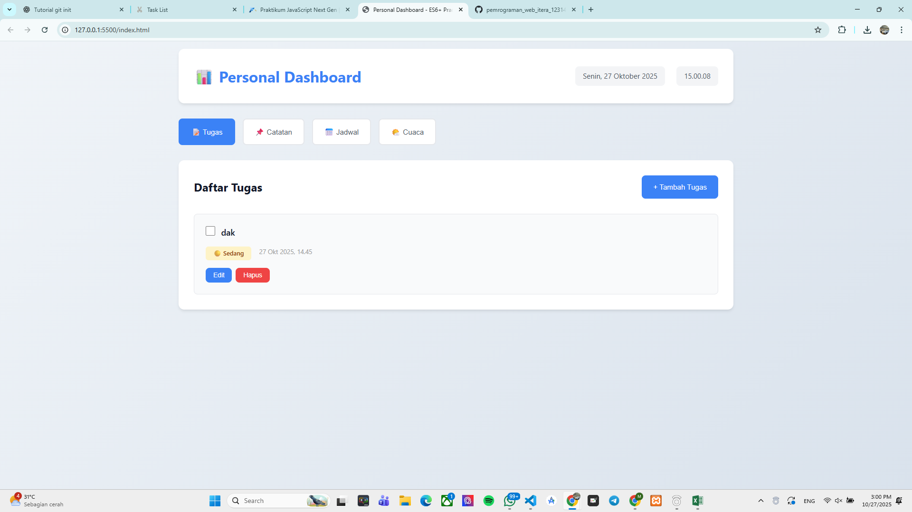

# Personal Dashboard - Aplikasi Praktikum ES6+

## 📋 Deskripsi Aplikasi

Personal Dashboard adalah aplikasi web interaktif yang membantu pengguna mengelola informasi pribadi mereka. Aplikasi ini menampilkan fitur manajemen tugas, catatan, jadwal, dan informasi cuaca real-time dengan antarmuka yang modern dan responsif.

## ✨ Fitur Utama

### 1. **Dashboard Ringkasan**

- Menampilkan statistik total tugas, tugas selesai, catatan, dan jadwal
- Update real-time saat ada perubahan data

### 2. **Manajemen Tugas**

- Tambah tugas baru
- Tandai tugas sebagai selesai/belum selesai
- Hapus tugas
- Penyimpanan otomatis ke localStorage

### 3. **Catatan**

- Buat catatan dengan judul dan konten
- Hapus catatan
- Tampilkan preview konten catatan
- Penyimpanan otomatis ke localStorage

### 4. **Jadwal**

- Tambah jadwal dengan waktu dan tanggal
- Otomatis diurutkan berdasarkan waktu
- Hapus jadwal
- Penyimpanan otomatis ke localStorage

### 5. **Informasi Cuaca**

- Cari cuaca berdasarkan nama kota
- Menampilkan suhu, deskripsi cuaca, kecepatan angin, dan kelembaban
- Menggunakan API Open-Meteo (gratis, tanpa API key)
- Error handling yang baik

### 6. **Fitur Tambahan**

- Jam dan tanggal real-time di header
- Navigasi tab yang smooth
- Desain responsif untuk mobile dan desktop
- Animasi transisi yang halus

## 🛠️ Fitur ES6+ yang Diimplementasikan

### 1. **Classes (Kelas)**

- `DashboardManager`: Mengelola semua data (tasks, notes, schedule)
- `WeatherManager`: Mengelola fetch data cuaca dan konversi kode cuaca

### 2. **Arrow Functions (Minimal 3)**

   Lebih dari 20 arrow functions diimplementasikan:

- `loadFromStorage = (key) => {...}`
- `saveToStorage = (key, data) => {...}`
- `addTask = (text) => {...}`
- `deleteTask = (id) => {...}`
- `toggleTask = (id) => {...}`
- `addNote = (title, content) => {...}`
- `deleteNote = (id) => {...}`
- `addSchedule = (title, time, date) => {...}`
- `deleteSchedule = (id) => {...}`
- `getStats = () => {...}`
- `getCoordinates = async (city) => {...}`
- `getWeather = async (city) => {...}`
- `getWeatherDescription = (code) => {...}`
- `renderTasks = () => {...}`
- `renderNotes = () => {...}`
- `renderSchedule = () => {...}`
- `updateStats = () => {...}`
- `escapeHtml = (text) => {...}`
- `completeTask = (id) => {...}`
- `deleteTaskItem = (id) => {...}`
- `deleteNoteItem = (id) => {...}`
- `deleteScheduleItem = (id) => {...}`
- `renderWeather = (weather) => {...}`
- `showWeatherError = (message) => {...}`
- `hideWeatherError = () => {...}`
- `updateTime = () => {...}`

### 3. **Template Literals**

- Digunakan untuk rendering dinamis HTML:
  \`\`\`javascript
  tasksList.innerHTML = tasks.map(task => `
 
${escapeHtml(task.text)}
 
`).join('');
  \`\`\`
- Digunakan untuk URL API:
  \`\`\`javascript
  `https://geocoding-api.open-meteo.com/v1/search?name=${encodeURIComponent(city)}`
  \`\`\`

### 4. **Async/Await (Fungsi Asinkron)**

- `getCoordinates = async (city) => {...}`: Fetch koordinat kota
- `getWeather = async (city) => {...}`: Fetch data cuaca
- Implementasi try-catch untuk error handling
- Contoh:
  \`\`\`javascript
  try {
  const weather = await weatherManager.getWeather(city);
  renderWeather(weather);
  } catch (error) {
  showWeatherError(`❌ ${error.message}`);
  }
  \`\`\`

### 5. **Let dan Const**

- Menggunakan `const` untuk variabel yang tidak berubah
- Menggunakan `let` untuk variabel yang berubah
- Contoh:
  \`\`\`javascript
  const dashboardManager = new DashboardManager();
  let tasks = this.loadFromStorage('tasks') || [];
  \`\`\`

### 6. **Fitur ES6+ Tambahan**

- **Destructuring**: `const { id, text, completed } = task`
- **Spread Operator**: Digunakan dalam array operations
- **Default Parameters**: `loadFromStorage(key) || []`
- **Array Methods**: `map()`, `filter()`, `find()`, `sort()`
- **Object Shorthand**: `{ id, text, completed }`

## 💾 Penyimpanan Data (localStorage)

Semua data disimpan di localStorage browser:

- **tasks**: Array tugas dengan id, text, completed, createdAt
- **notes**: Array catatan dengan id, title, content, createdAt
- **schedule**: Array jadwal dengan id, title, time, date, createdAt

Data otomatis dimuat saat aplikasi dibuka dan disimpan setiap kali ada perubahan.

## 🎨 Desain UI/UX

### Warna

- **Primary**: Biru (#3b82f6)
- **Secondary**: Hijau (#10b981)
- **Danger**: Merah (#ef4444)
- **Background**: Putih dan abu-abu terang

### Layout

- **Header**: Gradient biru dengan informasi waktu
- **Sidebar**: Navigasi tab yang responsif
- **Content**: Area utama dengan padding yang nyaman
- **Cards**: Desain modern dengan shadow dan hover effects

### Responsivitas

- Mobile-first design
- Breakpoint di 768px untuk tablet/desktop
- Flexbox dan Grid untuk layout yang fleksibel

## 🚀 Cara Menggunakan

1. Buka file `dashboard.html` di browser
2. Gunakan navigasi sidebar untuk berpindah antar fitur
3. Tambah, edit, atau hapus data sesuai kebutuhan
4. Data otomatis tersimpan di localStorage

## 📱 Kompatibilitas

- Chrome, Firefox, Safari, Edge (versi terbaru)
- Mobile browsers (iOS Safari, Chrome Mobile)
- Responsive design untuk semua ukuran layar

## 📊 Struktur File

\`\`\`
public/
├── dashboard.html      # File HTML utama
├── dashboard.css       # Styling dengan Tailwind-like approach
├── dashboard.js        # Logika aplikasi dengan ES6+
└── README.md          # Dokumentasi ini
\`\`\`

## 🔧 Teknologi yang Digunakan

- **HTML5**: Semantic markup
- **CSS3**: Modern styling dengan custom properties
- **JavaScript ES6+**:
  - Classes
  - Arrow Functions
  - Async/Await
  - Template Literals
  - Destructuring
  - Array Methods
- **localStorage API**: Penyimpanan data lokal
- **Open-Meteo API**: Data cuaca real-time (gratis)

## 📝 Catatan Pengembang

- Semua data disimpan di browser, tidak ada server backend
- API cuaca menggunakan Open-Meteo yang gratis dan tidak memerlukan API key
- Error handling untuk network requests dan user input
- Security: HTML escaping untuk mencegah XSS attacks

## 🎓 Pembelajaran ES6+

Aplikasi ini mendemonstrasikan penggunaan fitur-fitur modern JavaScript:

1. **OOP dengan Classes**: Struktur kode yang terorganisir
2. **Functional Programming**: Arrow functions dan array methods
3. **Async Programming**: Async/await untuk API calls
4. **DOM Manipulation**: Event listeners dan dynamic rendering
5. **Data Persistence**: localStorage untuk penyimpanan lokal

---

**Dibuat untuk Tugas Praktikum ES6+ JavaScript**
