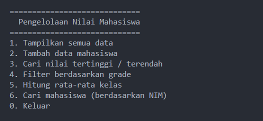
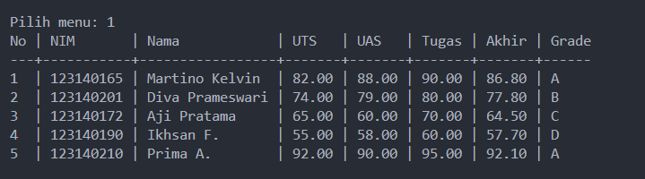

# 🐍 Praktikum Python Dasar

## 📘 Deskripsi
Program ini dibuat untuk memenuhi tugas **Praktikum Python Dasar** mata kuliah *Pemrograman Web ITERA*.  
Tujuan program ini adalah untuk mengelola data nilai mahasiswa menggunakan **bahasa Python** dengan konsep dasar pemrograman seperti variabel, struktur data, fungsi, dan kontrol alur.

---

## 🎯 Tujuan Praktikum
Setelah menyelesaikan praktikum ini, mahasiswa diharapkan mampu:
- Memahami konsep dasar Python sebagai bahasa pemrograman.
- Menggunakan variabel, tipe data, dan operator.
- Mengimplementasikan struktur kendali seperti `if-else` dan `loop`.
- Membuat dan memanggil fungsi.
- Menggunakan struktur data (`list`, `dict`, `tuple`, `set`).
- Memahami dan menggunakan modul Python.
- Menerapkan dasar OOP (Object-Oriented Programming).

---

## 🧩 Tugas: Program Pengelolaan Data Nilai Mahasiswa
Program ini memiliki fitur untuk mengelola data nilai mahasiswa dengan ketentuan sebagai berikut:

### Fitur Utama:
1. **Menampilkan Data Mahasiswa** dalam bentuk tabel rapi.
2. **Menambahkan Data Baru** melalui input pengguna.
3. **Menghitung Nilai Akhir** dengan rumus: Nilai Akhir = 30% UTS + 40% UAS + 30% Tugas

4. **Menentukan Grade Otomatis** berdasarkan nilai akhir:
- A: ≥80  
- B: ≥70  
- C: ≥60  
- D: ≥50  
- E: <50  
5. **Menampilkan Mahasiswa dengan Nilai Tertinggi dan Terendah.**
6. **Filter Mahasiswa Berdasarkan Grade.**
7. **Menghitung Rata-Rata Nilai Akhir Kelas.**

---

## 🗂️ Struktur Folder
pemrograman_web_itera_123140165/
│
├── martino_kelvin_123140165_pertemuan4/
│ ├── main.py
│ └── README.md


---

## ⚙️ Cara Menjalankan Program
1. Pastikan Python 3 sudah terinstall:
   ```bash
   python --version
2. Jalankan program:
   ```bash
   python main.py
3. Ikuti menu interaktif yang muncul di terminal.


---



## 👨‍💻 Identitas

Nama: Martino Kelvin
NIM: 123140165
Kelas : Pemweb RA
Program Studi: Teknik Informatika
Institusi: Institut Teknologi Sumatera (ITERA)


